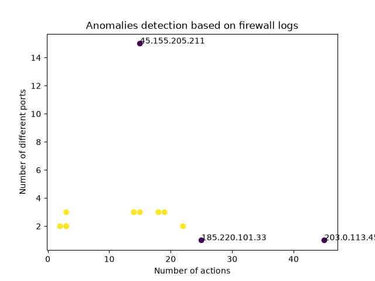

# 🔥 Firewall Log Analyser (OOP)

> An object-oriented tool that parses firewall logs and detects suspicious IP addresses using machine learning.
>
> Narzędzie obiektowe, które parsuje logi firewalla i wykrywa podejrzane adresy IP przy użyciu uczenia maszynowego.

🇬🇧 [English](#-english) | 🇵🇱 [Polski](#-polski)

---

## 🇬🇧 English

### 🎯 Project goal

A self-contained **firewall log analyser** that takes a raw firewall log and answers one security question: **which IP addresses are behaving suspiciously?** It parses the log, builds a numerical behavioural profile for each IP, uses an Isolation Forest model to flag the ones that stand out, and exports the result as a console report, a JSON file and a scatter plot.

This is **phase 1 (the local core)** of a larger project. The roadmap is: local core → streaming simulation + database → cloud deployment (AWS S3 / Lambda / SNS).

### 🧠 Why object-oriented?

Everything is wrapped in a single `FirewallAnalyser` class instead of loose scripts. The class bundles **data** (what it *has*) with **methods** (what it *can do*):

- **has** → the log path, the parsed records, the results table (`self.filepath`, `self.records`, `self.results`)
- **can do** → parse, analyze, run, report, save_report, plot

The class takes the log path at creation, so one class can analyse any file:

```python
analyzer = FirewallAnalyser("firewall_big.log")
analyzer.run()           # parse + analyze
analyzer.report()        # print suspicious IPs
analyzer.save_report()   # export them to report.json
analyzer.plot()          # visualise
```

### 📋 How the pipeline works

#### 1. `parse()` — raw log → structured records

Firewall logs use a `KEY=VALUE` format. The parser reads line by line, splits each line into chunks, and extracts `SRC`, `ACTION`, `DPT`, `PROTO`. Each line becomes one dictionary stored in `self.records`.

Variables are reset to `None` at the start of every line — so a line missing a field (e.g. an ICMP ping has no port) keeps a clean `None` instead of inheriting the previous line's value.

#### 2. `analyze()` — records → behavioural profile + anomaly detection

The records become a pandas DataFrame. Events are grouped per IP and summarised into features:

| Feature | Meaning | Attacker | Normal user |
|---|---|---|---|
| `total` | how active | high | moderate |
| `unique_ports` | port variety | high (scan) | 1–3 |
| `blocked` | times blocked | high | 0 |
| `blocked_ratio` | share blocked | ~1.0 | ~0.0 |

An **Isolation Forest** model then flags outliers: `1` = normal, `-1` = anomaly. The idea: anomalies are easy to isolate because they sit far from the crowd; normal points are hard to isolate because they are surrounded by similar points. `contamination=0.2` is the sensitivity dial (expected share of anomalies).

#### 3. `run()` — orchestration

A convenience method that calls `self.parse()` then `self.analyze()` in the correct order, so the caller doesn't have to remember the sequence.

#### 4. `report()` / `save_report()` — the output

- `report()` prints the anomalies (suspicious IPs) to the console.
- `save_report()` filters the anomalies, runs `reset_index()` so the IP address becomes a column (otherwise it would be lost as the DataFrame index), and writes them to `report.json`.

#### 5. `plot()` — visualisation

A scatter plot with activity (`total`) on X and port variety (`unique_ports`) on Y. These two features say *different* things, so different attack types land in different places: a brute-forcer (many attempts, one port) far right, a port scanner (many ports) high up. Colour encodes the model's verdict; only anomalies are labelled with their IP.



### 📊 Example result

On the sample log the model cleanly separates three attackers from normal traffic:

- **`203.0.113.45`** — brute-force (45 attempts, all on port 22 / SSH)
- **`45.155.205.211`** — port scan (15 different ports)
- **`185.220.101.33`** — hammering (port 445 / SMB)

`report.json` example:

```json
[
  { "src_ip": "203.0.113.45", "total": 45, "unique_ports": 1, "blocked": 45, "blocked_ratio": 1.0, "anomaly": -1 }
]
```

### 🚀 How to run

```bash
pip install pandas scikit-learn matplotlib
python firewall_analyser.py
```

Make sure `firewall_big.log` is in the same folder.

### 🛠️ Tech stack & concepts

Python · pandas · scikit-learn · matplotlib · object-oriented programming (`class`, `self`, methods calling methods) · feature engineering · anomaly detection

### 🗺️ Roadmap

- ✅ **Phase 1** — local core (this repo): parse, analyse, report, plot
- ⬜ **Phase 2** — streaming simulation + database storage
- ⬜ **Phase 3** — cloud deployment (AWS S3 + Lambda + SNS alerts)

---

## 🇵🇱 Polski

### 🎯 Cel projektu

Samodzielny **analizator logów firewalla**, który bierze surowy log i odpowiada na jedno pytanie bezpieczeństwa: **które adresy IP zachowują się podejrzanie?** Parsuje log, buduje liczbowy portret zachowania każdego IP, używa modelu Isolation Forest do wskazania tych, które odstają, i eksportuje wynik jako raport w konsoli, plik JSON oraz wykres punktowy.

To **faza 1 (lokalny rdzeń)** większego projektu. Mapa drogowa: lokalny rdzeń → symulacja strumienia + baza danych → wdrożenie w chmurze (AWS S3 / Lambda / SNS).

### 🧠 Po co programowanie obiektowe?

Wszystko jest zamknięte w jednej klasie `FirewallAnalyser` zamiast luźnych skryptów. Klasa wiąże **dane** (co *ma*) z **metodami** (co *umie*):

- **ma** → ścieżkę do logu, sparsowane rekordy, tabelę wyników (`self.filepath`, `self.records`, `self.results`)
- **umie** → parse, analyze, run, report, save_report, plot

Klasa przyjmuje ścieżkę do logu przy tworzeniu, więc jedna klasa może analizować dowolny plik:

```python
analyzer = FirewallAnalyser("firewall_big.log")
analyzer.run()           # parsuj + analizuj
analyzer.report()        # wypisz podejrzane IP
analyzer.save_report()   # wyeksportuj do report.json
analyzer.plot()          # zwizualizuj
```

### 📋 Jak działa pipeline

#### 1. `parse()` — surowy log → uporządkowane rekordy

Logi firewalla mają format `KLUCZ=WARTOŚĆ`. Parser czyta linia po linii, rozbija każdą linię na kawałki i wyłuskuje `SRC`, `ACTION`, `DPT`, `PROTO`. Każda linia staje się słownikiem zapisanym w `self.records`.

Zmienne są resetowane na `None` na początku każdej linii — więc linia bez jakiegoś pola (np. ping ICMP nie ma portu) zachowuje czyste `None` zamiast dziedziczyć wartość z poprzedniej linii.

#### 2. `analyze()` — rekordy → portret zachowania + wykrywanie anomalii

Rekordy stają się DataFrame pandas. Zdarzenia są grupowane po IP i podsumowane w cechy:

| Cecha | Znaczenie | Napastnik | Normalny user |
|---|---|---|---|
| `total` | jak aktywne | wysoki | umiarkowany |
| `unique_ports` | różnorodność portów | wysoka (skan) | 1–3 |
| `blocked` | liczba blokad | wysoka | 0 |
| `blocked_ratio` | udział blokad | ~1.0 | ~0.0 |

Model **Isolation Forest** wskazuje punkty odstające: `1` = normalny, `-1` = anomalia. Idea: anomalie łatwo odizolować, bo leżą daleko od tłumu; punkty normalne trudno, bo są otoczone podobnymi. `contamination=0.2` to pokrętło czułości (spodziewany udział anomalii).

#### 3. `run()` — orkiestracja

Wygodna metoda, która woła `self.parse()`, a potem `self.analyze()` w poprawnej kolejności, żeby użytkownik nie musiał jej pamiętać.

#### 4. `report()` / `save_report()` — wynik

- `report()` wypisuje anomalie (podejrzane IP) w konsoli.
- `save_report()` filtruje anomalie, wywołuje `reset_index()`, żeby adres IP stał się kolumną (inaczej zniknąłby jako index DataFrame), i zapisuje je do `report.json`.

#### 5. `plot()` — wizualizacja

Wykres punktowy z aktywnością (`total`) na osi X i różnorodnością portów (`unique_ports`) na osi Y. Te dwie cechy mówią *różne* rzeczy, więc różne typy ataków lądują w różnych miejscach: brute-forcer (wiele prób, jeden port) daleko w prawo, skaner portów (wiele portów) wysoko. Kolor koduje werdykt modelu; podpisane są tylko anomalie (ich IP).


### 📊 Przykładowy wynik

Na przykładowym logu model czysto oddziela trzech napastników od normalnego ruchu:

- **`203.0.113.45`** — brute-force (45 prób, wszystkie na port 22 / SSH)
- **`45.155.205.211`** — skanowanie portów (15 różnych portów)
- **`185.220.101.33`** — hammering (port 445 / SMB)

Przykład `report.json`:

```json
[
  { "src_ip": "203.0.113.45", "total": 45, "unique_ports": 1, "blocked": 45, "blocked_ratio": 1.0, "anomaly": -1 }
]
```

### 🚀 Jak uruchomić

```bash
pip install pandas scikit-learn matplotlib
python firewall_analyser.py
```

Upewnij się, że `firewall_big.log` jest w tym samym folderze.

### 🛠️ Technologie i pojęcia

Python · pandas · scikit-learn · matplotlib · programowanie obiektowe (`class`, `self`, metody wołające metody) · inżynieria cech · wykrywanie anomalii

### 🗺️ Mapa drogowa

- ✅ **Faza 1** — lokalny rdzeń (to repo): parse, analyze, report, plot
- ⬜ **Faza 2** — symulacja strumienia + zapis do bazy danych
- ⬜ **Faza 3** — wdrożenie w chmurze (AWS S3 + Lambda + alerty SNS)
