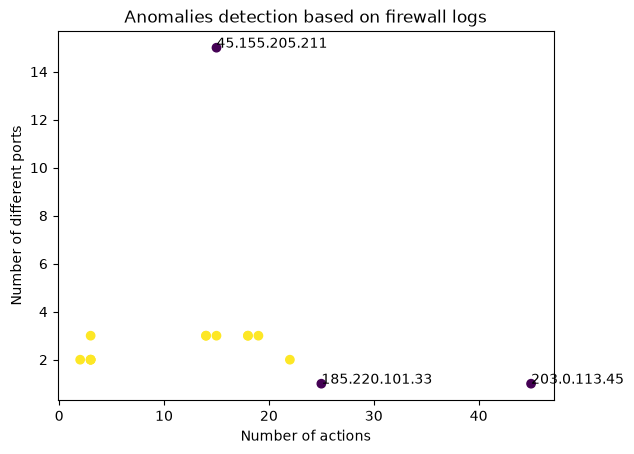

# 🔥 Firewall Log Anomaly Detection

> Detecting potential attacks in firewall logs using log parsing, feature engineering and an Isolation Forest model.
>
> Wykrywanie potencjalnych ataków w logach firewalla przy użyciu parsowania logów, inżynierii cech i modelu Isolation Forest.

🇬🇧 [English](#-english) | 🇵🇱 [Polski](#-polski)

---

## 🇬🇧 English

### 🎯 Project goal

The goal is to **automatically detect suspicious IP addresses** (potential attackers) in raw firewall logs. Instead of manually scanning thousands of log lines, the program builds a numerical "behavioural profile" for each IP and lets a machine-learning model flag the ones that stand out.

The project demonstrates a complete, realistic data pipeline:

```
raw log → parser → table → features per IP → ML model → visualization
```

This is the same flow used in real security analytics work: turn messy raw data into structured features, then let a model find the anomalies.

### 🧠 Why these steps?

The key idea is **separation of concerns** — each stage does one job:

- The **parser** turns chaotic text into structured records (once).
- **pandas** answers any question about that structured data cheaply.
- **Feature engineering** translates "behaviour" into numbers a model can read.
- The **model** finds outliers automatically, at a scale the human eye cannot.
- The **chart** makes the result visible and explainable.

### 📋 Pipeline explained

#### Stage 1 — Parser: raw log → list of records

Firewall logs use a `KEY=VALUE` format:

```
Jun 8 09:14:07 fw01 kernel: [...] SRC=203.0.113.45 ... DPT=22 ACTION=DROP
```

The parser reads the file line by line, splits each line into chunks, and extracts the fields it needs (`SRC`, `ACTION`, `DPT`, `PROTO`). Each line becomes one dictionary; all dictionaries go into a list.

**Why reset variables to `None` at the start of each line?** Two reasons:
1. **Missing fields** — some lines (e.g. ICMP pings) have no port. Without a reset the variable would simply stay unset.
2. **No leakage between lines** — without the reset, a line missing a field would inherit the previous line's value, corrupting the data.

```python
for line in file:
    source = action = dpt = protocol = None   # clean slate per line
    for part in line.split():
        if part.startswith("SRC="):
            source = part.split("=", 1)[1]     # text after the first "="
        # ... ACTION=, DPT=, PROTO=
    records.append({"src_ip": source, "action": action,
                    "dpt": dpt, "protocol": protocol})
```

#### Stage 2 — Bridge: records → pandas DataFrame

`pd.DataFrame(records)` converts the list of dictionaries into a table (dictionary keys become column names). We also add a helper column marking whether each event was blocked:

```python
df["is_blocked"] = df["action"] != "ACCEPT"
```

This is a **whole-column operation** — pandas evaluates the condition for all rows at once, no loop needed. That's the core strength of pandas.

#### Stage 3 — Feature engineering: events → behavioural profile per IP

A model understands numbers, not "logs". We group events by IP and compute features describing each address's behaviour:

```python
group = df.groupby("src_ip").agg(
    total=("action", "count"),          # how active
    unique_ports=("dpt", "nunique"),    # scanning many ports?
    blocked=("is_blocked", "sum"),      # how often blocked
)
group["blocked_ratio"] = group["blocked"] / group["total"]
```

Each feature encodes a hypothesis about attacks:

| Feature | Meaning | Attacker | Normal user |
|---|---|---|---|
| `total` | activity volume | high | moderate |
| `unique_ports` | port variety | high (scan) | 1–3 |
| `blocked` | times blocked | high | 0 |
| `blocked_ratio` | share blocked | ~1.0 | ~0.0 |

#### Stage 4 — Model: Isolation Forest

Isolation Forest isolates points by asking "is value > X?". **Anomalies are easy to isolate** (extreme, alone); **normal points are hard** (surrounded by similar ones).

```python
X = group[["total", "unique_ports", "blocked", "blocked_ratio"]]
model = IsolationForest(contamination=0.2, random_state=42)
group["anomaly"] = model.fit_predict(X)   # 1 = normal, -1 = anomaly
```

- **`contamination`** is the sensitivity dial — the expected share of anomalies. Higher = more aggressive (catches more, but more false positives); lower = more conservative.
- **`random_state`** makes the result reproducible.

This is the fundamental security trade-off: too sensitive → false alarm fatigue; too conservative → missed attacks.

#### Stage 5 — Visualization

A scatter plot with `total` (activity) on X and `unique_ports` (behaviour type) on Y. These two features say *different* things, so different attack types land in different places — a brute-forcer (many attempts, one port) lands far right; a scanner (many ports) shoots up. Colour encodes the model's verdict; only anomalies are labelled to keep the chart readable.

### 📊 Results

The model cleanly separates three attackers from normal traffic:

- **`203.0.113.45`** — brute-force (45 attempts, all on port 22/SSH)
- **`45.155.205.211`** — port scan (15 different ports)
- **`185.220.101.33`** — hammering (port 445/SMB)



### 🛠️ Tech stack

Python · pandas · scikit-learn · matplotlib

---

## 🇵🇱 Polski

### 🎯 Cel projektu

Celem jest **automatyczne wykrywanie podejrzanych adresów IP** (potencjalnych napastników) w surowych logach firewalla. Zamiast ręcznie przeglądać tysiące linii, program buduje liczbowy „portret zachowania" każdego IP i pozwala modelowi uczenia maszynowego wskazać te, które odstają.

Projekt pokazuje kompletny, realistyczny przepływ danych:

```
surowy log → parser → tabela → cechy per IP → model ML → wizualizacja
```

To ten sam przepływ, którego używa się w prawdziwej analityce bezpieczeństwa: zamień chaotyczne surowe dane w uporządkowane cechy, a potem pozwól modelowi znaleźć anomalie.

### 🧠 Po co te etapy?

Kluczowa idea to **podział odpowiedzialności** — każdy etap robi jedną rzecz:

- **Parser** zamienia chaotyczny tekst w uporządkowane rekordy (raz).
- **pandas** tanio odpowiada na dowolne pytanie o te uporządkowane dane.
- **Inżynieria cech** tłumaczy „zachowanie" na liczby, które model rozumie.
- **Model** automatycznie znajduje odstające punkty — w skali, której oko nie ogarnia.
- **Wykres** czyni wynik widzialnym i zrozumiałym.

### 📋 Pipeline krok po kroku

#### Etap 1 — Parser: surowy log → lista rekordów

Logi firewalla mają format `KLUCZ=WARTOŚĆ`:

```
Jun 8 09:14:07 fw01 kernel: [...] SRC=203.0.113.45 ... DPT=22 ACTION=DROP
```

Parser czyta plik linia po linii, rozbija każdą linię na kawałki i wyłuskuje potrzebne pola (`SRC`, `ACTION`, `DPT`, `PROTO`). Każda linia staje się jednym słownikiem; wszystkie słowniki trafiają do listy.

**Dlaczego reset zmiennych na `None` na początku każdej linii?** Dwa powody:
1. **Brakujące pola** — niektóre linie (np. pingi ICMP) nie mają portu. Bez resetu zmienna po prostu zostałaby nieustawiona.
2. **Brak „wycieku" między liniami** — bez resetu linia bez jakiegoś pola odziedziczyłaby wartość z poprzedniej linii, zafałszowując dane.

```python
for line in file:
    source = action = dpt = protocol = None   # czysta kartka co linię
    for part in line.split():
        if part.startswith("SRC="):
            source = part.split("=", 1)[1]     # tekst po pierwszym "="
        # ... ACTION=, DPT=, PROTO=
    records.append({"src_ip": source, "action": action,
                    "dpt": dpt, "protocol": protocol})
```

#### Etap 2 — Most: rekordy → tabela pandas

`pd.DataFrame(records)` zamienia listę słowników w tabelę (klucze słowników stają się nazwami kolumn). Dodajemy też kolumnę pomocniczą oznaczającą, czy zdarzenie było zablokowane:

```python
df["is_blocked"] = df["action"] != "ACCEPT"
```

To **operacja na całej kolumnie naraz** — pandas sprawdza warunek dla wszystkich wierszy jednocześnie, bez pętli. To jest rdzeń siły pandas.

#### Etap 3 — Inżynieria cech: zdarzenia → portret per IP

Model rozumie liczby, nie „logi". Grupujemy zdarzenia po IP i liczymy cechy opisujące zachowanie każdego adresu:

```python
group = df.groupby("src_ip").agg(
    total=("action", "count"),          # jak aktywne
    unique_ports=("dpt", "nunique"),    # skanowanie wielu portów?
    blocked=("is_blocked", "sum"),      # jak często blokowane
)
group["blocked_ratio"] = group["blocked"] / group["total"]
```

Każda cecha koduje hipotezę o atakach:

| Cecha | Znaczenie | Napastnik | Normalny user |
|---|---|---|---|
| `total` | wolumen aktywności | wysoki | umiarkowany |
| `unique_ports` | różnorodność portów | wysoka (skan) | 1–3 |
| `blocked` | liczba blokad | wysoka | 0 |
| `blocked_ratio` | udział blokad | ~1.0 | ~0.0 |

#### Etap 4 — Model: Isolation Forest

Isolation Forest izoluje punkty pytaniami „czy wartość > X?". **Anomalie łatwo odizolować** (ekstremalne, samotne); **punkty normalne trudno** (otoczone podobnymi).

```python
X = group[["total", "unique_ports", "blocked", "blocked_ratio"]]
model = IsolationForest(contamination=0.2, random_state=42)
group["anomaly"] = model.fit_predict(X)   # 1 = normalny, -1 = anomalia
```

- **`contamination`** to pokrętło czułości — spodziewany udział anomalii. Wyższe = agresywniej (łapie więcej, ale więcej fałszywych alarmów); niższe = ostrożniej.
- **`random_state`** zapewnia powtarzalność wyniku.

To fundamentalny kompromis bezpieczeństwa: zbyt czuły → zmęczenie fałszywymi alarmami; zbyt ostrożny → przegapione ataki.

#### Etap 5 — Wizualizacja

Wykres punktowy z `total` (aktywność) na osi X i `unique_ports` (typ zachowania) na osi Y. Te dwie cechy mówią *różne* rzeczy, więc różne typy ataków lądują w różnych miejscach — brute-forcer (wiele prób, jeden port) ląduje daleko w prawo; scanner (wiele portów) wystrzeliwuje w górę. Kolor koduje werdykt modelu; podpisane są tylko anomalie, by wykres pozostał czytelny.

### 📊 Wyniki

Model czysto oddziela trzech napastników od normalnego ruchu:

- **`203.0.113.45`** — brute-force (45 prób, wszystkie na port 22/SSH)
- **`45.155.205.211`** — skanowanie portów (15 różnych portów)
- **`185.220.101.33`** — hammering (port 445/SMB)


### 🛠️ Technologie

Python · pandas · scikit-learn · matplotlib
